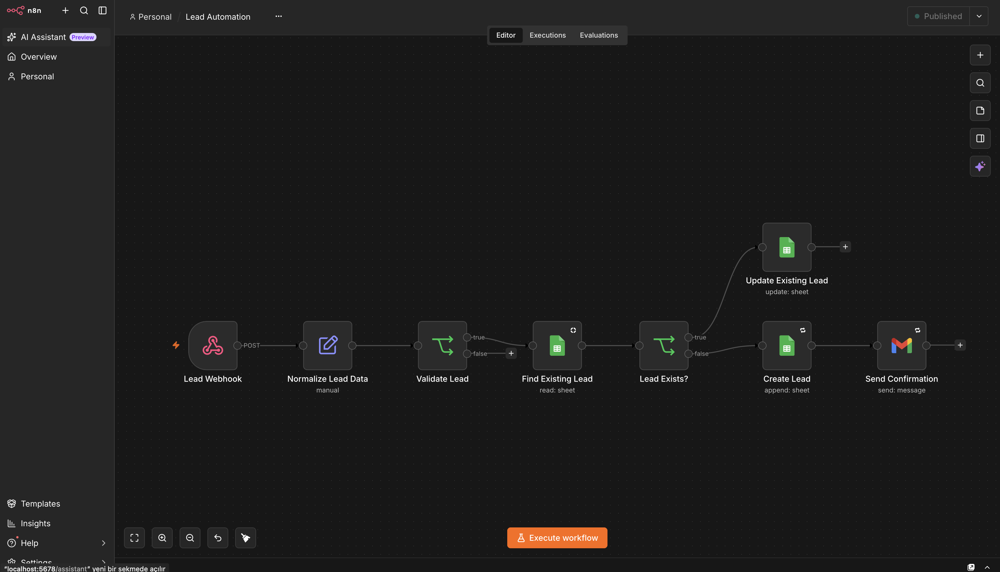
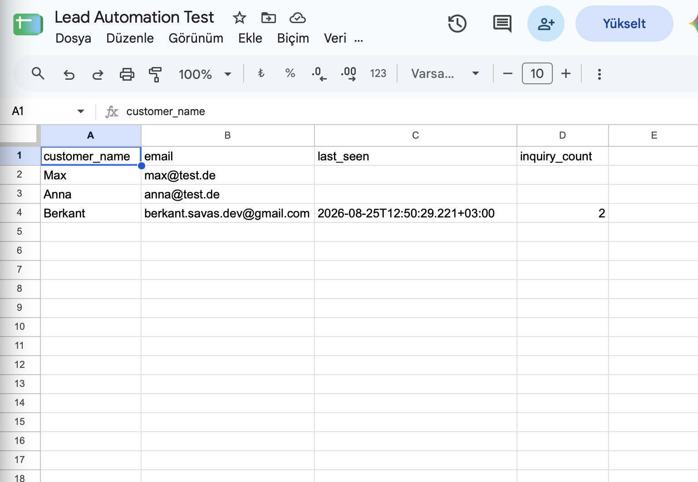
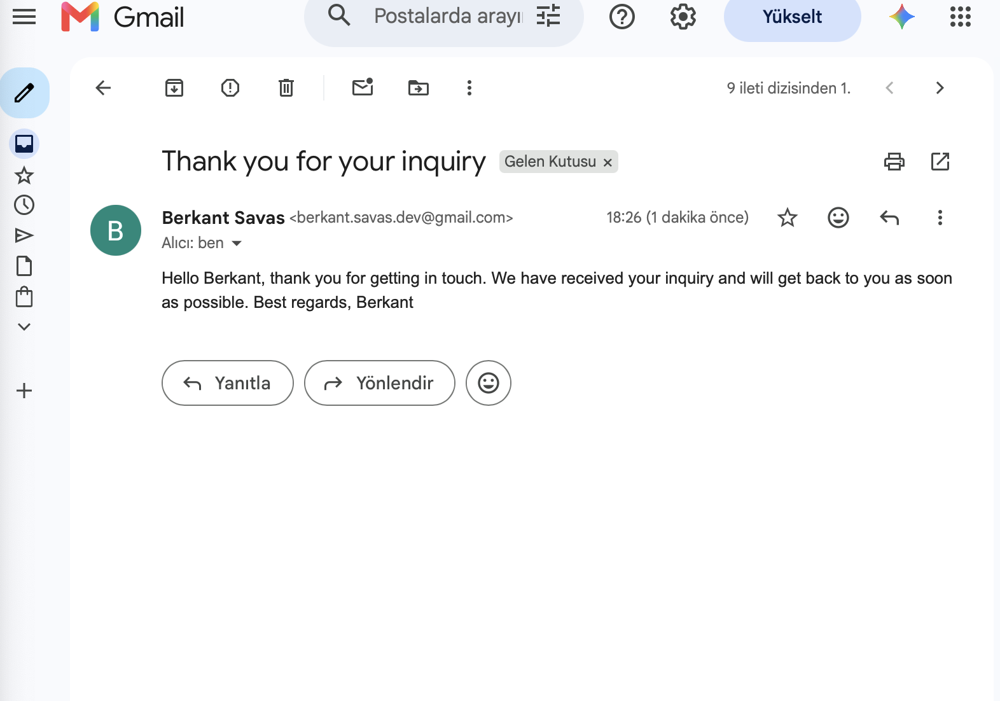
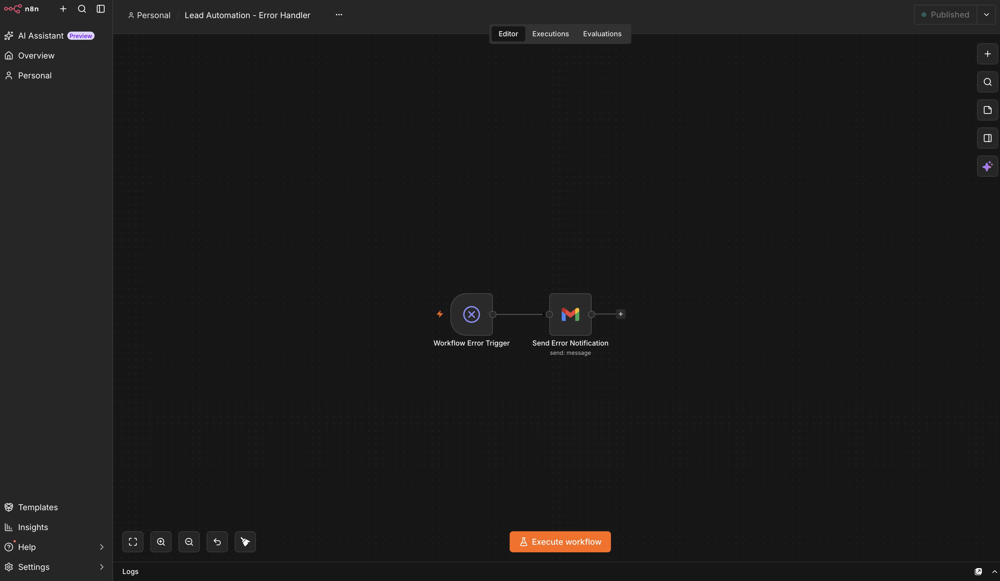
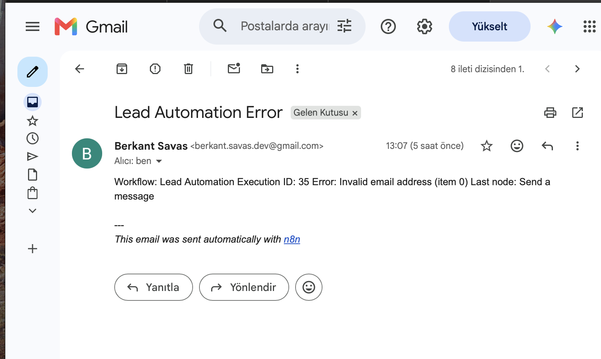

# Lead Automation with n8n

A production-oriented lead automation project built with n8n.

The workflow receives website inquiries, validates incoming data, checks whether a lead already exists, stores or updates the lead in Google Sheets, sends an automatic confirmation email, and reports workflow failures through a dedicated error handler.

> This repository is intended as a portfolio showcase. The full importable production workflow and private credentials are intentionally not included.

## Workflow

Lead Webhook → Normalize Lead Data → Validate Lead → Find Existing Lead → Lead Exists?

If the lead already exists:
Lead Exists? → Update Existing Lead

If the lead is new:
Lead Exists? → Create Lead → Send Confirmation

A separate error workflow handles production failures:

Workflow Error Trigger → Send Error Notification

## Features

- Receive lead inquiries through a webhook
- Normalize incoming JSON data
- Validate required customer name and email fields
- Validate basic email format using Regex
- Search Google Sheets for an existing lead
- Prevent normal duplicate rows
- Create new leads automatically
- Update existing leads when the same email address submits another inquiry
- Track the latest inquiry with `last_seen`
- Track repeat inquiries with `inquiry_count`
- Send automatic confirmation emails
- Retry Google Sheets and Gmail operations on temporary failures
- Dedicated production error workflow
- Internal error notifications with workflow name, execution ID, error message and last executed node

## Lead Validation

Incoming leads are validated before they are stored.

The workflow checks:

- customer name is not empty
- email is not empty
- email matches a basic email format

The email validation uses the following Regex:

`^[^\s@]+@[^\s@]+\.[^\s@]+$`

Invalid leads are stopped before Google Sheets or Gmail are executed.

## Duplicate Handling

New leads are created with:

`inquiry_count = 1`

and:

`last_seen = current timestamp`

When the same email address submits another inquiry, the workflow does not create another row.

Instead:

- the existing lead is updated
- `last_seen` receives a new timestamp
- `inquiry_count` is increased by 1

Example:

| customer_name | email | last_seen | inquiry_count |
|---|---|---|---:|
| Customer | customer@example.com | latest timestamp | 3 |

This gives the business owner one clean lead record while still showing how often the customer has contacted the company.

## Google Sheets Integration

Google Sheets is connected through a dedicated Google Service Account.

The target spreadsheet is shared directly with the Service Account instead of giving the automation broad access through a personal Google account.

The workflow accesses the spreadsheet directly by URL instead of browsing the user's Google Drive.

The original broad Google Sheets OAuth credential was removed from the n8n setup.

## Gmail Integration

Confirmation emails are sent through the Gmail API using Google OAuth 2.0.

The Gmail credential uses the least-privilege scope:

`https://www.googleapis.com/auth/gmail.send`

This allows the workflow to send emails without requiring permission to:

- read the inbox
- delete messages
- manage labels
- read email history

The n8n attribution footer is disabled for customer-facing confirmation emails.

## Retry Strategy

Google Sheets and Gmail operations use retry handling for temporary API or network failures.

Current configuration:

- Max tries: 3
- Wait between retries: 1000 ms
- On final error: Stop Workflow

If the workflow still fails after the configured retries, the dedicated error workflow can handle the failure.

## Error Handling

A separate n8n workflow is used for production error handling.

The error workflow consists of:

Workflow Error Trigger → Send Error Notification

If the main workflow fails, an internal notification email is sent containing:

- workflow name
- execution ID
- error message
- last executed node

The error handler was tested by intentionally causing the Gmail node to fail with an invalid recipient.

The test successfully triggered the error workflow and generated an internal error notification.

## Security

Security measures implemented in this project include:

- n8n encryption key stored through a local `.env` file
- `.env` excluded from Git
- Service Account private key not stored in this repository
- downloaded Service Account JSON removed after credential setup
- Service Account credential stored encrypted inside n8n
- least-privilege Gmail `gmail.send` OAuth scope
- direct spreadsheet access instead of broad Google Drive browsing
- no API keys committed to this repository
- no OAuth access tokens committed to this repository
- no OAuth refresh tokens committed to this repository
- no passwords committed to this repository
- no client secrets committed to this repository
- no private keys committed to this repository
- complete production workflow JSON files excluded from the public repository

The public repository demonstrates the architecture, implementation and security decisions without distributing a ready-to-import production workflow.

## Public Webhook Security

A public browser-based contact form requires different protection from a server-to-server API.

A static secret placed inside browser JavaScript would not provide meaningful protection because users can inspect browser requests and source code.

For a real production deployment, suitable protections may include:

- backend or serverless proxy between the website and n8n
- server-to-server authentication
- rate limiting
- CAPTCHA or Cloudflare Turnstile
- honeypot fields
- strict payload validation

The current validation workflow already provides part of the payload validation layer.

## Known Scaling Consideration

The current duplicate logic follows a read → decide → write pattern using Google Sheets.

For small-business lead volumes this is practical.

However, two nearly simultaneous requests using the same email address could theoretically create a race condition if both executions check the spreadsheet before either one writes its result.

For higher-volume production environments, possible improvements include:

- serialized execution
- queue-based processing
- a database with unique constraints
- a dedicated CRM
- asynchronous lead processing

Google Sheets is intentionally used in this project because it gives non-technical business owners a simple and familiar interface for viewing their leads.

## Gmail Production Status

The current Gmail OAuth application is still configured in Google Auth Platform Testing mode.

For a real production deployment, the planned setup includes:

- a dedicated business domain
- application homepage
- privacy policy
- authorized domain
- Google OAuth production configuration

A business email domain should also be configured with:

- SPF
- DKIM
- DMARC

This improves professional email deliverability and reduces the chance that automated confirmation emails are classified as spam.

## Local Development

The project currently runs locally using Docker and n8n.

Start the environment with:

`docker compose up -d`

Stop it safely with:

`docker compose stop`

The persistent n8n data volume should not be removed unless deletion is intentional.

The Docker configuration in this repository is intended for local development.

A real customer deployment should use production-grade hosting with a public HTTPS endpoint.

## Production Roadmap

Before deploying this system for a real customer, the planned production improvements include:

- dedicated n8n hosting
- HTTPS
- public production webhook URL
- public-form abuse protection
- customer-specific privacy and data-processing review
- backup strategy for n8n data
- backup of the n8n encryption key
- Google OAuth production configuration
- dedicated business email domain
- SPF
- DKIM
- DMARC
- monitoring
- alert throttling for repeated system failures
- improved concurrency handling for higher traffic

## Technologies

- n8n
- Docker
- Google Sheets API
- Google Service Account
- Gmail API
- OAuth 2.0
- Webhooks
- JSON

## Screenshots

### Main Lead Automation

### Lead Tracking in Google Sheets

### Confirmation Email

### Error Handler Workflow

### Error Notification

## Repository Scope

This repository is a portfolio showcase of the architecture, workflow design, security decisions and results of the project.

The complete production n8n workflow files and credentials remain private and are not included in the public repository.